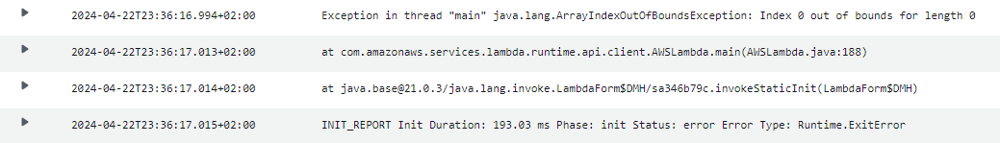
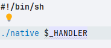

## Errors

---
### Index out of bounds (Alleen met custom runtime)

Deze error kan gekregen worden doordat er bij gebruik van een Custom runtime in de bootstrap file niet `$_HANDLER` 
staat direct achter de naam van de executable zie onderstaande foto. Hierin is ./native de manier om de executable uit te voeren.



---
### Bootstrap Errors
Soms kan het voorkomen dat er in de Cloudwatch logs staat dat de bootstrap niet gevonden kan worden. 
Dit kan meerdere redenen hebben:
- De bootstrap file staat niet in de root van de zip file of staat er überhaupt niet in
- Soms kan de runtime de bootstrap file niet vinden om dat deze geen unix line feeds heeft (LF i.p.v. CRLF) Soms zal hij het wel doen met CRLF, waarom is onbekend.
- Er is een error zelf in de bootstrap (dit kan van alles zijn)
- Uit ervaring kan het zippen van de executable beter over gelaten worden aan de maven plugin i.p.v. het met een docker command te doen (het kan zeker gedaan worden in docker, maar het switchen naar de maven plugin werkte altijd) (voor een voorbeeld kan naar de POM van SpringCloudFunctions gekeken worden)

---
### Opmerkingen

#### AWS-Xray

tijdens het testen viel op dat stacks met de AWS xray sdk enabled erg traag zijn bij het opstarten. 
Vooral de xray-trace die op de dynamodb staat (zie code ``new TracingInterceptor`` ). Hierdoor is deze niet gebruikt. Het scheelt ongeveer 500 ms duration bij het opstarten van de PlainJava project zonder enige project die aan staat (dus geen GraalVM of snapstart)

```java  
private static final DynamoDbClient dynamoDbClient = DynamoDbClient.builder()
    .credentialsProvider(DefaultCredentialsProvider.create())
    .region(Region.of(System.getenv(SdkSystemSetting.AWS_REGION.environmentVariable())))
    .httpClientBuilder(UrlConnectionHttpClient.builder())
    .overrideConfiguration(ClientOverrideConfiguration.builder()
        .addExecutionInterceptor(new TracingInterceptor())
        .build())
  .build();
```
Deze slowdown is alleen bij het gebruik van de snapstart en zonder snapstart. Bij het gebruik van GraalVM is deze slowdown niet zichtbaar


#### Resource priming

In de init duration van de functie worden alle klassen die nodig zijn geïnitialiseerd. Er kan dus bij het aanmaken van de DynamoDB client alvast een request gestuurd worden om deze connectie goed optezetten zodat deze gelijk klaar is voor gebruik wanneer de functie wordt uitgevoerd. Dit kan door middel van een describe table request.
```java

dynamoDbClient.describeTable(DescribeTableRequest.builder()
  .tableName(PRODUCT_TABLE_NAME)
  .build());
```
deze code kan prima in een static block in de klasse van de dynamodb. Voor deze projecten is dat DynamoProductDao.